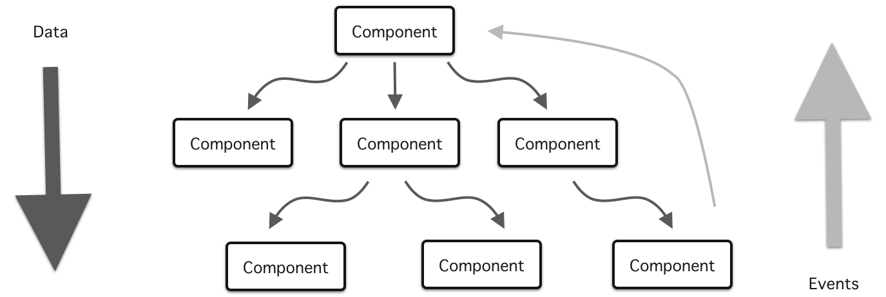

# React Lifting State

| Term | Definition |
| ---- | ---------- |
| __Data flow__ | The direction in which data is passed within a React application. In React, data flows down from the parent component to its children components. |
| __Lifting state__ | The process of moving the state of a component higher up in the component hierarchy to be shared with its parent or sibling components. |
| __Thinking in React__ | An approach to building React applications that involves breaking down the app into a component hierarchy and building a static version before adding functionality. |
| __Component hierarchy__ | The structure of components in a React application, where components are organized in a tree-like structure with parent-child relationships. |
| __Static version__ | A non-interactive version of a React component or app that represents the desired layout and appearance. |

---

## Thinking in React

| Step | Description |
| ---- | ---------- |
| __Start with a mock__ | Take the time to make wireframes and write out other details about your app. |
| __Break the UI into a component hierarchy__ | Clarify which elements will be grouped as different React components within your wireframe and determine which elements go inside other elements. |
| __Build a static version first__ | Before adding conditional rendering, forms, or other functionality, first create a static view. |
| __Identify the minimal complete representation of UI state__ | Determine which data will have state and which data will be passed on as props. Add props to your app. It's ok to use some mock data/mock array of objects. |
| __Identify where your state should live__ | State should go down to the lowest (most nested) component possible. If state must be shared across components, put state in the lowest common ancestor. If you can't find a good common ancestor, create one. Add state to start replacing your mock data. |
| __Add inverse data flow (lift state)__ | There are times when state must be shared across components. This should be the final piece you work on. |

---

## Data flow and management in React

- What are the advantages of a downward data flow?
- What do we use to send data upwards?



## Lifting State

- What `state` is being controlled by the `App.js`?
- What is the default value of our `state`?
- What code represents our `event handler`?
- What `state` is being passed down as `props` and to which components?
- Of the state being passed down, what do we expected to be `lifted`?

```jsx
// src/App.js
function App() {
  let [color, selectColor] = useState("white");

  function chooseColor(color) {
    selectColor(color);
  }

  return (
    <div className="App">
      <header>
        <h1>Sketchpad</h1>
      </header>
      <main>
        <Aside color={color} />
        <Sketchpad color={color} resetBoard={resetBoard} />
        <Palette colors={colors} chooseColor={chooseColor} />
      </main>
    </div>
  );
}
```

- The `Square` component isn't called in the `App.js` file. Which component can we assume its getting its props from based on the example above?
- What is the purpose of the `key` attribute? Why is it set to `color`?
- What `event listener` does the `Square` component use?
- What `event handler` does the event listener call?
- Where is the `event handler` defined?
- What is being `lifted` from this component?
- What component is it being `lifted` to?

```js
// src/Square.js
export default function Square({ color, chooseColor }) {
  return (
    <div
      key={color}
      style={{ backgroundColor: color, height: "40px", width: "40px" }}
      onClick={() => chooseColor(color)}
    />
  );
}
```