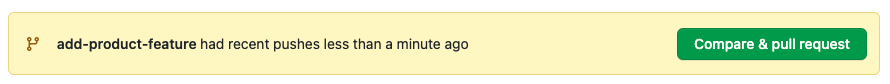
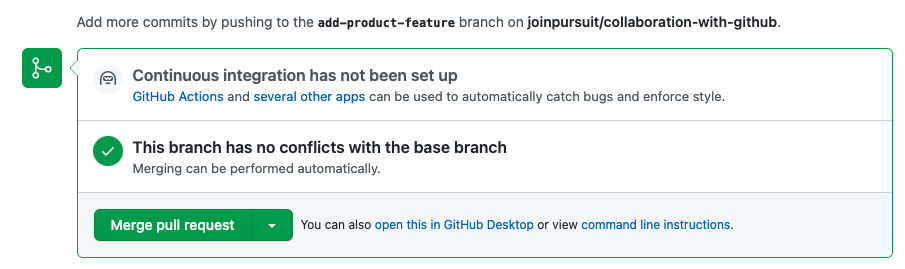

# Collaboration with Github

| Term | Definition |
| ---- | ---------- |
| __Git__ |  A program that tracks changes in files and allows for collaboration among developers. |
| __GitHub__ | A website that provides a platform for hosting Git repositories and facilitating collaboration. |
| __Branching__ | The process of creating separate lines of development in a Git repository. |
| __History__ | When a branch is created, it initially shares the same history as the branch where the command was run. However, as new commits are made, branches can become out of sync with each other. |
| __Main&nbsp;Branch__ | The default branch in a Git repository, typically representing the latest stable version of the project. |
| __Feature&nbsp;Branch__ | A feature branch is a separate branch created from the main branch, allowing developers to work on specific features independently, isolate changes, collaborate effectively, and merge the completed feature back into the main branch after testing and validation. |
| __Commit__ | A snapshot of the project at a specific point in time. |
| __Merge__ | Combining changes from one branch into another branch. |
| __Pull&nbsp;Request__ | A GitHub feature that enables developers to propose changes and merge them into another branch. |


---

## Creating branches

- How would you create a branch called `add-product-feature`?
- What are some best practices when naming branches?
- What are some good examples of branch names?
- How could you prefix your branch name with your name or username?

```bash
git branch <branch-name>
```

## Viewing branches

- What identifier does terminal give to the current branch you are working on?
- How do you exit the screen that shows your list of branches?

```bash
git branch
```

## Switching to a branch

- What terminal changes do you notice after changing branches?
- Run `git branch` again after switching, what has changed?
- What's the difference between `switch` and `checkout`?

    [Git Docs for Reference](https://git-scm.com/docs)

```bash
# Switch Branches
git switch <branch-name>
git checkout <branch-name>

# Create Branch AND Switch
git switch -c <branch-name>
git checkout -b <branch-name>
```

## Merging branches locally

- What is the following code doing?
- Which branch is being merged into which?
- What kind of branch is `add-product-feature`?

```bash
# Syntax
git merge <branch-name>

# Example
git switch main
git merge add-product-feature
```

## Branches with Github

It is common when working on a team to follow this process:

1. Create a new feature branch.
1. Complete work on that feature branch.
1. Push your feature branch to GitHub.
1. Create a Pull Request.
1. Have someone else on your team review your code.
1. Merge your Pull Request from GitHub.

This process is a good one to follow because it allows you to share your work with other members of your team.

### Pushing branches to Github

- What does the `origin` represent in this code?
- What branch should you be on when you push?

```bash
# Syntax
git push origin <branch-name>

# Example
git switch add-product-feature
git push origin add-product-feature
```

### Merging via Github

- When you push a branch to Github, what does it offer you the option to do?
- Why should you share your pull request with other team members when working on a team?
- Which branch are the changes merged into?




## Pulling

- What does a pull accomplish?
- What's the difference between these two commands?

```bash
git pull origin main
git pull
```