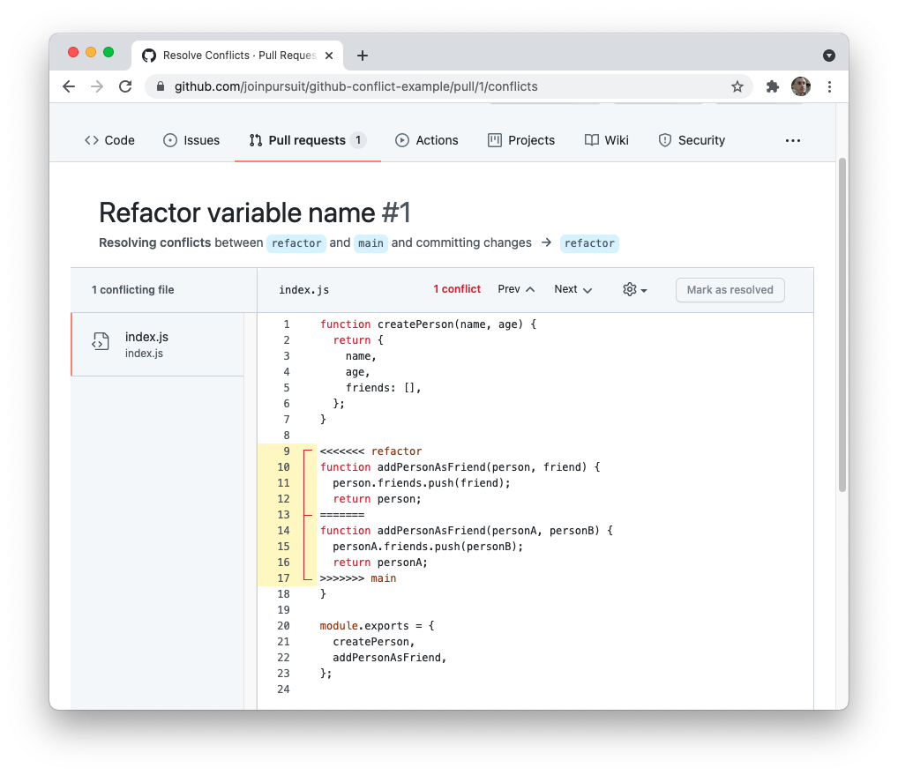
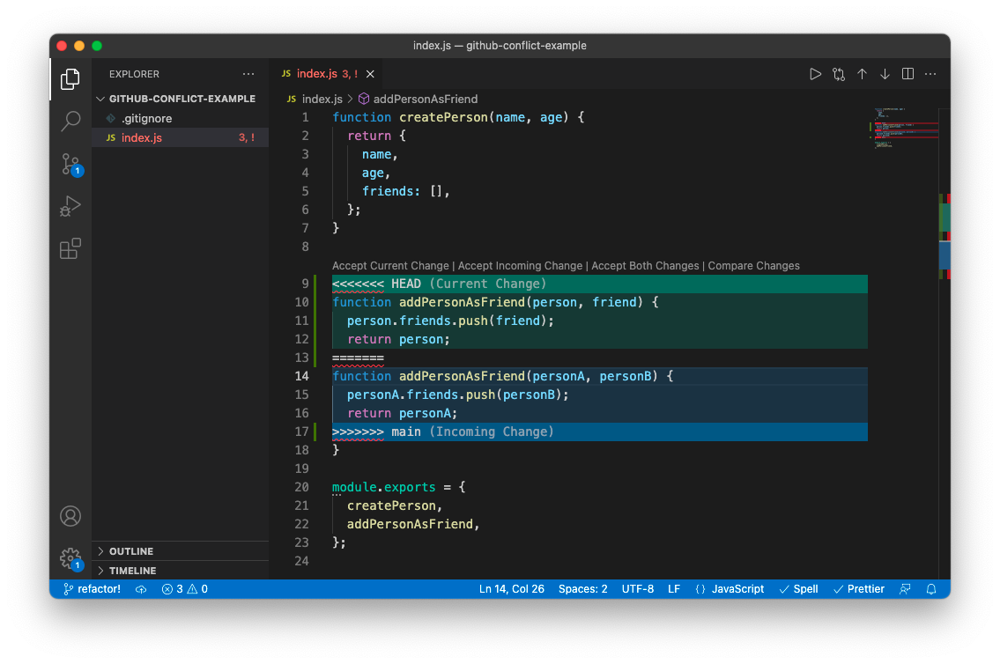
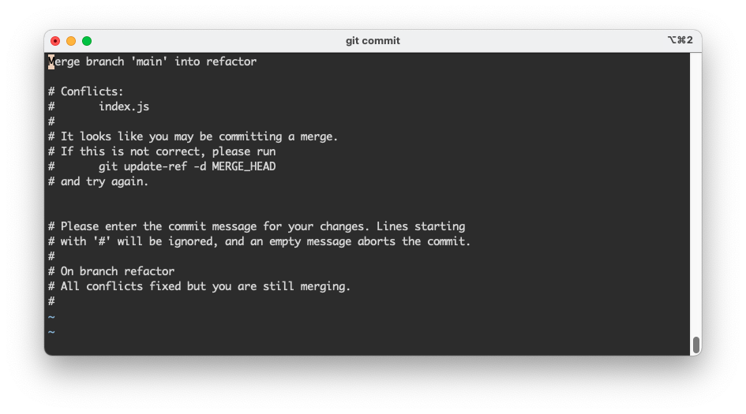

# Merge conflicts

| Term | Definition |
| ---- | ---------- |
| __Merge&nbsp;Conflicts__ |  Occur when Git attempts to merge together two branches that have conflicting changes in the same code section. |
| __Separating&nbsp;Work__ | It is useful to have different members of your team working on different files. Not only does this help you avoid conflicts, but it's generally a better architecture to have many small files as opposed to a few large files. |
| __Branch&nbsp;Management__ | Teams often discourage direct pushes to the main branch. Instead, feature branches should be used and reviewed by other members of the team. That way, if a merge conflict occurs, it may just be for a single branch as opposed to everyone's branches. |

---

## Managing conflicts through Github

- Why is the highlighted region being flagged as a merge conflict?
- How do you identify which branch the highlighted changes are from?
- What is the 3-step process for resolving the conflict?



## Managing conflicts locally

- What is this error message in the terminal telling us?
- Which file do you need to open in order to resolve the conflict?

```bash
Auto-merging index.js
CONFLICT (content): Merge conflict in index.js
Automatic merge failed; fix conflicts and then commit the result.
```

- What lines reflect the merge conflict? How can you tell?
- What do the different options alongside the top of the merge conflict do?
- What other way can you resolve this conflict?



- This is the git status after you've solved your conflict and saved your file. What is it telling you to do next?

```bash
On branch refactor
You have unmerged paths.
  (fix conflicts and run "git commit")
  (use "git merge --abort" to abort the merge)

Unmerged paths:
  (use "git add <file>..." to mark resolution)
	both modified:   index.js

no changes added to commit (use "git add" and/or "git commit -a")
```

- At what point do you end up on this screen?
- How do you save and quit from this screen?
- What does your git log look like now?

