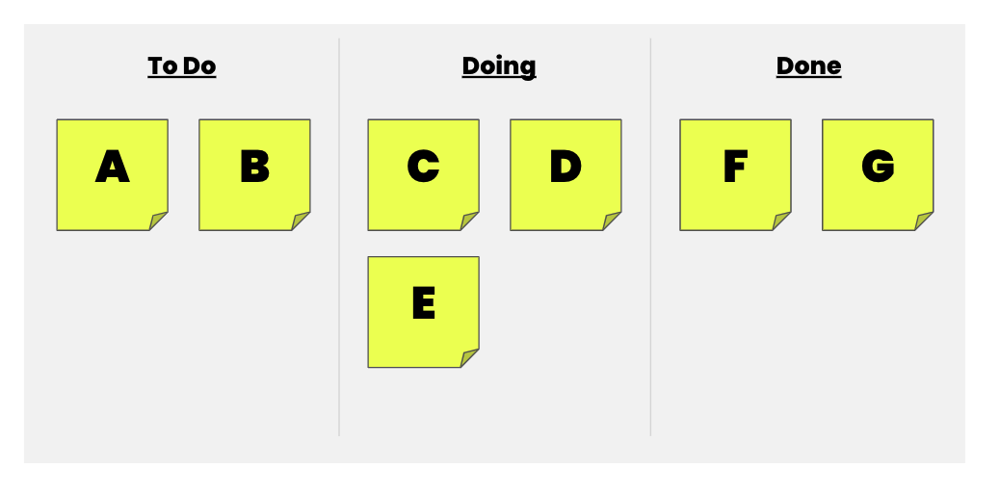

# Project Workflow

| Term | Definition |
| ---- | ---------- |
| __Stand-up__ |  A short daily meeting where team members answer three questions to align their goals and address any blockers. |
| __Blockers__ | Obstacles or issues that prevent team members from completing their work. |
| __Kanban&nbsp;board__ | A visual project tracking tool with columns representing different stages of work (e.g., To Do, Doing, Done). |
| __Tasks/Cards__ | Work items that are created and assigned to team members to track their progress. |
| __Scoping__ | Defining the scope and size of a task to ensure it is well-defined and manageable. |
| __Business&nbsp;concerns__ | Focusing on the functional requirements and goals of a feature rather than specific implementation details. |
| __User&nbsp;story&nbsp;format__ | A format used to describe features from a user's perspective. (As a [TYPE OF USER], I want [SOME GOAL] so that [SOME REASON]) |
| __Trello__ | A popular project management tool used for creating and managing Kanban boards. |

---

## Summary

1. Conduct daily stand-up meetings to keep the team aligned and address any blockers.
1. Use a Kanban board to visualize and track the progress of tasks.
1. Write well-scoped tasks that are associated with specific features or user stories.
1. Focus on business concerns and functional requirements when writing tasks, rather than implementation details.
1. Utilize the user story format to provide clear context and purpose for each feature.
1. Use a project management tool like Trello to create and manage Kanban boards, assign tasks, add details, and collaborate with team members.

## Working as a developer

- Collaborate effectively within development teams.
- Understand the purpose and structure of stand-up meetings.
- Answer the three questions in a stand-up meeting: What was accomplished yesterday, what will be accomplished today, and are there any blockers?
- Address blockers through collaboration and pair programming.

__Knowledge Check__

- [ ] What is the purpose of a stand-up meeting in a development team?
- [ ] What are the three questions typically addressed during a stand-up meeting?
- [ ] How can pair programming help in addressing blockers and improving work efficiency?

## Kanban boards

- Utilize Kanban boards for project tracking.
- Understand the structure of a Kanban board with columns like To Do, Doing, and Done.
- Reference tasks during stand-up meetings for transparency and progress visibility.

__Knowledge Check__

- [ ] What is a Kanban board and how does it aid in project management?
- [ ] What are the typical columns found on a Kanban board and what do they represent?
- [ ] How can Kanban boards enhance task visibility and enable effective project tracking?

## Writing tasks

- Write well-scoped tasks for effective project management.
- Avoid large, vague task descriptions.
- Stay feature-focused rather than getting caught up in implementation details.
- Utilize the user story format for detailed and purposeful task descriptions.

__Knowledge Check__

- [ ] Why is it important to scope tasks appropriately when writing feature tasks?
- [ ] What is the recommended approach for writing task descriptions, and why is a feature-focused perspective beneficial?
- [ ] How can the user story format enhance task understanding and contribute to effective project planning?

## Trello

- Use Trello as a tool for creating Kanban boards and managing projects.
- Create a new board, set up columns, and invite collaborators on Trello.
- Create cards, add task details, assign labels, people, and due dates on Trello for efficient task management.

__Knowledge Check__

- [ ] What is Trello and how can it be utilized for effective project management?
- [ ] What are the steps involved in creating a new board on Trello and setting it up with columns?
- [ ] How can Trello's features, such as adding labels, assigning people, and setting due dates, contribute to improved task management and team coordination?

## Best Practice Developer Workflow

1. __Pull the latest changes:__ Before starting any work, ensure you have the latest version of the `main` branch by running `git pull origin main`. This ensures you have the most up-to-date codebase to branch off from.

1. __Create a feature branch:__ Create a new branch from the `main` branch using a descriptive and meaningful name that reflects the purpose of your feature. It's recommended to follow branch naming conventions like using prefixes such as `feature/` for feature branches, `bug/` for bug fix branches, or `hotfix/` for critical issue fixes. For example: `git checkout -b feature/add-product`.

1. __Develop your feature:__ Make changes, add new files, and modify existing code to implement your feature. Use incremental commits (`git commit`) to track your progress as you work.

1. __Sync with `main` branch:__ Regularly update your feature branch with the latest changes from the `main` branch to avoid conflicts and keep your branch up to date. Switch back to the `main` branch (`git checkout main`) and pull the latest changes (`git pull origin main`). Then switch back to your feature branch (`git checkout feature/add-product`) and merge the `main` branch into your feature branch (`git merge main`). Resolve any merge conflicts that may arise.

1. __Testing and QA:__ Once your feature is complete and functional, thoroughly test it to ensure it meets the requirements and does not introduce any regressions. If possible, automate tests to streamline the QA process. If applicable, deploy your feature to a staging environment for additional testing.

1. __Open a pull request:__ After your feature has passed QA and is ready to be integrated into the main codebase, push your feature branch to the remote repository (`git push origin feature/add-product`). Then, on the GitHub website, open a pull request (PR) to merge your feature branch into the `main` branch. Provide a clear and concise description of the changes and tag relevant team members for review.

1. __Code review and collaboration:__ Share your pull request with other team members for review and feedback. Collaborate on the changes, addressing any comments or suggestions. The PR serves as a collaborative space to discuss the code changes and ensure code quality.

1. __Merge into main:__ Once your pull request has been approved and any necessary changes have been made, merge your feature branch into the `main` branch using the GitHub website. This ensures a controlled and documented integration of your feature into the main codebase.

__Knowledge Check__

- [ ] What is the purpose of pulling the latest changes from the main branch before creating a feature branch?
- [ ] What are some recommended branch naming conventions to follow?
- [ ] Why is it important to regularly sync your feature branch with the main branch during development?
- [ ] How can you initiate a code review process for your feature before merging it into the main branch?
- [ ] What are the benefits of opening a pull request to merge a feature branch into the main branch?
- [ ] How can you merge a feature branch into the main branch using the GitHub website?
- [ ] What should be considered when conducting testing and QA for a feature before merging it into the main branch?