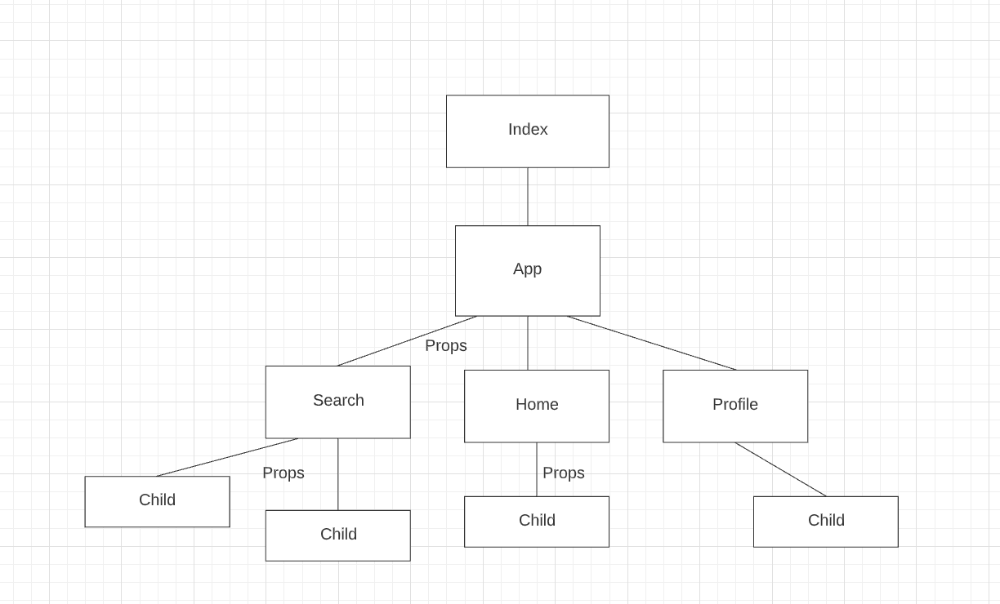

# React Props

| Term | Definition |
| ---- | ---------- |
| __Props__ | Props allow components to pass information to child components that they're rendering. They are used to consume data from parent components and render it to the user. |
| __Functional Components__ | Components defined as functions that accept props as arguments. They are a simpler and more concise way of defining components in React. |
| __Container Components__ | Components that are responsible for handling data and business logic. They fetch, store, and update information, and may pass data down to display components via props. |
| __Display Components__ | Components that are responsible for receiving props and rendering data. They focus on presenting the UI and don't handle complex logic or state management. |

---

## Parent component (App.js) passing props to a child component (User)

- What information is being passed to the `<User />` component?
- How would you access that information in the `User` component?

```jsx
const App = () => {
  let userDetails = {
    name: "Jimmy B",
    userId: 7348,
    email: "jimmy@pursuit.org",
  };
  return <User name={userDetails.name} />;
};
```

## Child component (User) accessing and rendering props

- What is `const { name } = props;` doing?
- Could you access props a different way?
- Why do we put the variable `name` in brackets inside of our `<h1>`?

```jsx
const User = (props) => {
  const { name } = props;

  return (
    <div className="user-details">
      <h1>{name}</h1>
    </div>
  );
};
```

## Using the spread operator to pass props

- What is `{...userDetails}` doing?
- What would this look like written out?

```jsx
const App = () => {
  let userDetails = {
    name: "Jimmy B",
    userId: 7348,
    email: "jimmy@pursuit.org",
  };
  return <User {...userDetails} />;
};
```

## Rendering a list of items (ProductItem) using props

- What data type is `products`?
- What does the `map` method do?
- How does the `map` method differ in React?
- What is `{listItems}` going to display?

```jsx
const ProductPage = () => {
  const products = [
    { name: "Ultra Boost", manufacturer: "Adidas", price: 160 },
    { name: "Air Force One Low", manufacturer: "Nike", price: 100 },
    { name: "Classic Leather", manufacturer: "Reebok", price: 120 },
    { name: "Sk8-Hi", manufacturer: "Vans", price: 60 }
  ];

  const listItems = products.map(product => {
    return (
      <ProductItem
        name={product.name}
        price={product.price}
      />
    );
  });

  return (
    <div>
      <ul>{listItems}</ul>
    </div>
  );
};
```

## The component architecture with smart (container) and dumb (display) components

